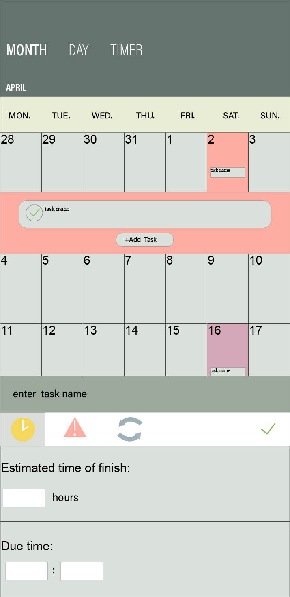
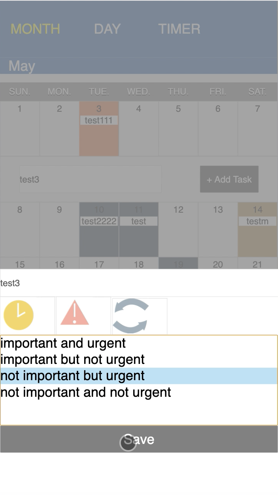
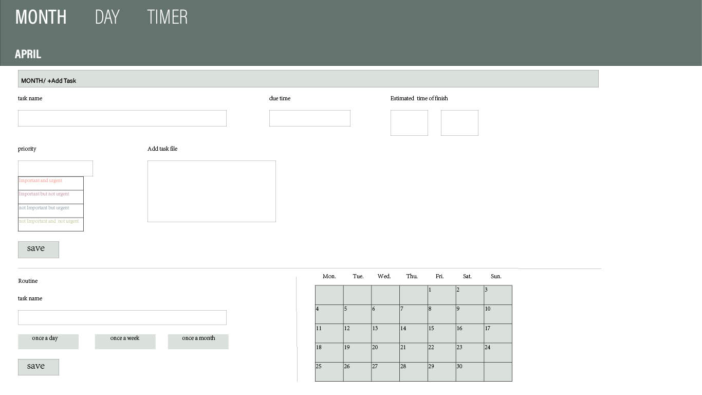
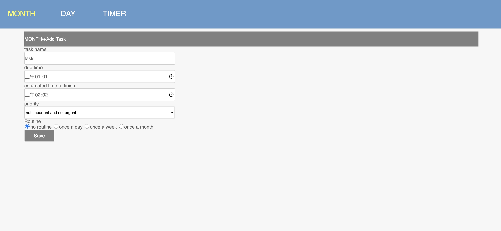

# deco2017_a3
## Software localization
### Learn about time planning and task management.

## The basic function
### Create a schedule. Prioritize tasks. Mission overview. The timer. Music player.

## PC page
### Public documents

## Mobile page
### Mobile file

## Directions for use
### 1. On the web page, select a deadline on the calendar and click.
### 2. Set the task name
### 3. Select task importance and urgency levels.
##### The selection will be displayed in different colors on the calendar.
### 4. Select whether the task is cyclic.
##### Select different routine transaction cycles and display them on the calendar.
### 5. Click "DAY "to view the task overview and select whether to delete the task.
### 6. Click "TIMER" to use the TIMER and music player functions.

## Contrast figure

## iteration

